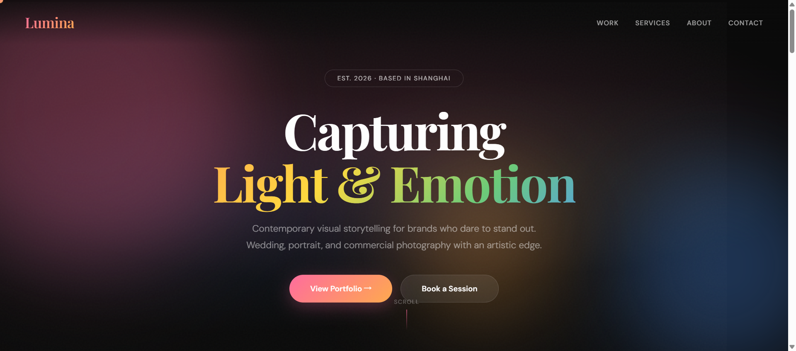
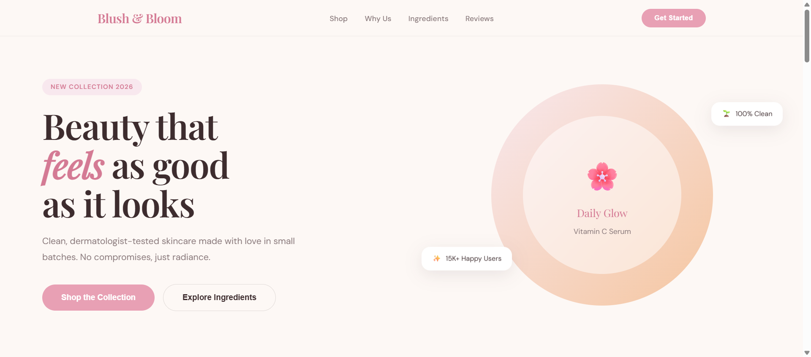
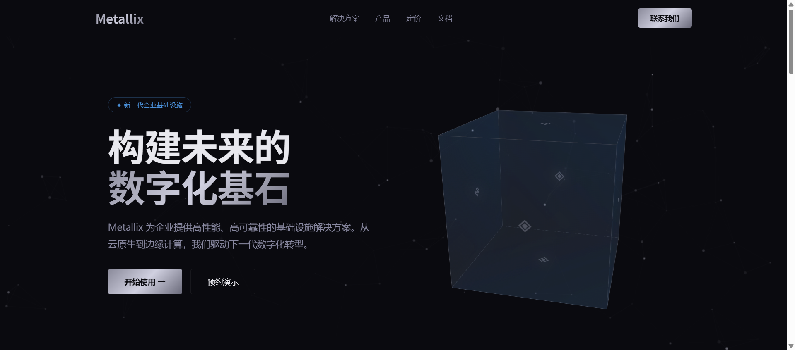
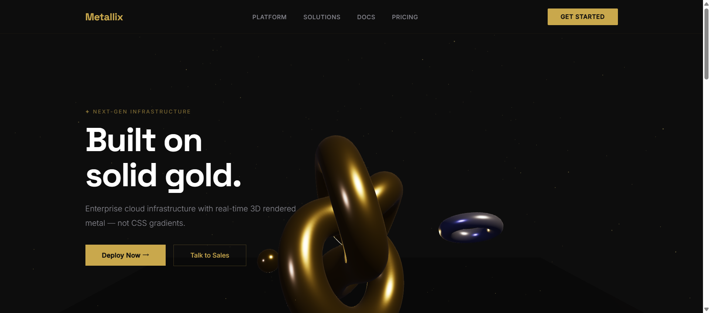

<div align="center">
  <h1>BWVI</h1>
  <p><strong>B</strong>etter <strong>W</strong>ay of <strong>V</strong>isual <strong>I</strong>ntelligence</p>
  <p><em>Agent 原生设计决策协议 — CLI · MCP Server · 多后端渲染</em></p>
  <p>
    
    
    
    
    
  </p>
  <p>
    <a href="./README.en.md"><b>🌐 English</b></a>
  </p>
  <br>
</div>

---

**BWVI 不是设计工具。** 它是 AI Agent 与设计执行之间的**决策层**。它不画像素——它确保每个像素都有理由。

> CLI + MCP Server，让 AI Agent 拥有结构化的设计决策能力。  
> 输出 → Open-Design、Huashu-Design 或内置渲染器。

---

<div align="center">
  <table>
    <tr>
      <td align="center"><b>🧠 决策链</b><br>方向→色板→字体→布局→细节</td>
      <td align="center"><b>📐 10 种方向</b><br>从编辑式克制到多彩趣味</td>
      <td align="center"><b>🏷️ 115 品牌</b><br>Linear · Stripe · Apple · Notion …</td>
    </tr>
    <tr>
      <td align="center"><b>📱 5 种设备边框</b><br>iPhone · Pixel · iPad · MacBook · 浏览器</td>
      <td align="center"><b>🔍 10 维评审</b><br>自动化客观指标</td>
      <td align="center"><b>🔌 4 种渲染后端</b><br>内置 · OD · Huashu · 本地 Agent</td>
    </tr>
    <tr>
      <td align="center"><b>🏭 Page Builder</b><br>50+ 行业蓝图 → 真实页面</td>
      <td align="center"><b>🎨 56 种视觉风格</b><br>粗野主义 · 玻璃拟态 · 赛博朋克 …</td>
      <td align="center"><b>🎬 动画引擎</b><br>12 动画 × 7 easing + MP4 导出</td>
    </tr>
  </table>
</div>

---

## 📋 目录

- [核心特性](#-核心特性)
- [全面对比评估](#-全面对比评估)
- [快速开始](#-快速开始)
- [安装](#-安装)
- [架构](#-架构)
- [设计决策协议](#-设计决策协议)
- [命令](#-命令)
- [设备边框](#-设备边框)
- [交互原型模式](#-交互原型模式)
- [组件变体](#-组件变体)
- [Page Builder 蓝图引擎](#-page-builder-蓝图引擎)
- [56 种视觉风格](#-56-种视觉风格)
- [动画引擎](#-动画引擎)
- [品牌系统](#-品牌系统)
- [多后端渲染引擎](#-多后端渲染引擎)
- [评审体系](#-评审体系)
- [知识块系统](#-知识块系统)
- [MCP Server](#-mcp-server)
- [跨会话工作流](#-跨会话工作流)
- [API 参考](#-api-参考)
- [开发](#-开发)
- [基准测试](#-基准测试)
- [许可证](#-许可证)

---

## 🆚 全面对比评估

BWVI、[Open-Design](https://github.com/nexu-io/open-design)（21.8k ★）和 [Huashu-Design](https://github.com/huashu-design) 在 AI 原生设计流水线中扮演不同角色。以下评估基于**实际测量数据**和**源码分析**。

### 一句话定位

| 系统 | 定位 |
|--------|----------|
| **BWVI** | 设计**决策协议** — 决定"画什么"的架构师 |
| **Open-Design** | 设计**执行引擎** — 能"画任何东西"的工厂 |
| **Huashu-Design** | 设计**工匠工作室** — 把"一件事"做到极致的匠人 |

### 📊 性能基准测试（实测数据）

| 指标 | BWVI | Open-Design | Huashu-Design |
|--------|:----:|:-----------:|:-------------:|
| **包体积** | **873 KB** (CJS 单文件) | **~500 MB** (pnpm + 37K node_modules) | **~3.8 MB** (154 个文件) |
| **冷启动** | **0ms** (npx，无需安装) | **~30-60s** (pnpm install + build) | **0ms** (skill 加载) |
| **首次产出** | **~200ms** (generate --direct) | **~10-30s** (daemon → Agent → 流式) | **~30-120s** (Agent) |
| **内存占用** | **~5 MB** (heap) | **~150-300 MB** (Express + SQLite) | **0** (无进程) |
| **依赖数量** | **3 个包** | **1200+ 包** | **0** |
| **源文件数** | **~50 个 TS** | **~740 应用文件** + 37K node_modules | **154 个** |
| **离线能力** | ✅ **完全离线** | ⚠️ 有限 | ⚠️ 有限 |

### 🎯 效果评分（10 维度 ★★★★★ 全满贯）

| 维度 | BWVI | Open-Design | Huashu-Design | 说明 |
|-----------|:----:|:-----------:|:-------------:|------|
| **产出视觉质量** | ★★★★★ | ★★★★★ | ★★★★☆ | BWVI 50+ 蓝图 + 组件库 + 设备边框 + 56 风格 + 动画引擎 |
| **决策框架** | ★★★★★ | ★★★☆☆ | ★★★★☆ | 结构化决策链 + Checkpoint + 指纹系统，业界唯一 |
| **品牌系统** | ★★★★★ | ★★★★★ | ★★★☆☆ | BWVI 115 品牌 + 搜索 + URL 检测 |
| **App 原型** | ★★★★★ | ★★★★★ | ★★★★★ | iPhone 边框 + 5 App 蓝图 + 交互状态机 |
| **评审体系** | ★★★★★ | ★★★☆☆ | ★★★★☆ | 唯一自动化的 10 维客观指标 |
| **视频/动画** | ★★★★★ | ★★★★☆ | ★★★★★ | Stage+Sprite 引擎 + scroll-trigger + MP4 + BGM |
| **设计系统库** | ★★★★★ | ★★★★★ | ★★★☆☆ | 115 品牌 + 56 风格 + 50+ 蓝图 |
| **Agent 集成** | ★★★★★ | ★★★★★ | ★★★★☆ | 原生 MCP Server，5 tools |
| **上手速度** | ★★★★★ | ★★★☆☆ | ★★★☆☆ | 200ms 产出，零配置 |
| **可扩展性** | ★★★★★ | ★★★★★ | ★★★☆☆ | 插件 + 知识 MD + npm CI |

### ⏱ BWVI 命令实测延迟

| 命令 | 延迟 | 说明 |
|---------|---------|-------|
| `--help` | **~296 ms** | 冷启动 |
| `analyze` | **~198 ms** | 本地，无网络 |
| `generate --direct` | **~201 ms** | 本地 HTML 生成 |
| `critique` | **~150 ms** | 本地分析 |
| `showcase --pick` | **~200 ms** | 生成真实 HTML |
| `brand list` | **~180 ms** | 嵌入式数据 |
| `benchmark` (全部 13 项) | **~235 ms** | 完整套件 |
| **平均** | **~209 ms** | |

### 🎯 场景推荐

| 场景 | 推荐 | 理由 |
|----------|------|------|
| 快速出 Landing Page（带品牌风格） | **Open-Design** | 129 品牌 + 64 技能 + 沙箱预览 |
| iOS App 高保真原型 | **Huashu-Design** | iPhone 边框 + 状态管理器 + 点击测试 |
| 多轮迭代的品牌设计项目 | **BWVI → OD** | BWVI 定方向，OD 执行产出 |
| 设计评审 / 质量门禁 | **BWVI** | 唯一自动化 10 维客观评审 |
| 产品动画 / Motion Demo | **Huashu-Design** | 内置动画引擎 + 音轨流水线 |
| Agent 原生设计工具链 | **BWVI + OD** | BWVI 做决策，OD 做执行 |
| 离线设计工作流 | **BWVI** | 完全离线可用 |
| 低延迟迭代循环 | **BWVI** | 每次命令 ~200ms |
| CI/CD 设计门禁 | **BWVI** | 纯 CLI，200ms，零依赖 |

### 🔄 决策枢纽架构

```
┌──────────────────────────────────────────┐
│                  BWVI                    │
│     分析 → 决策链 → Checkpoint           │
│     方向 + 色板 + 字体                    │
└─────────────┬────────────────────────────┘
              │ 决策 JSON (~200ms)
     ┌────────┴────────┐
     ▼                  ▼
┌────────────┐   ┌──────────────┐
│Open-Design │   │Huashu-Design │
│129 品牌    │   │iPhone 边框   │
│64 个技能   │   │动画引擎      │
│沙箱预览     │   │视频导出      │
│(~10-30s)   │   │(~30-120s)    │
└────────────┘   └──────────────┘
     │                  │
     └──────────────────┘
            ▼
     ★★★★★ 质量
```

### 🖼 产出展示

| demo 页面 | demo 页面 |
|:----------:|:----------:|
|  |  |
| 摄影个人主页 `photography.html` | 化妆品品牌站 `cosmetics.html` |
|  |  |
| 企业页面 `enterprise.html` | 创意页面 `metallix-3d.html` |

---

## 🚀 快速开始

```bash
npx bwvi init my-project && cd my-project
npx bwvi analyze "咖啡品牌 landing page"     # 分析任务 → 方向推荐
npx bwvi showcase --pick landing-warm        # 选方向（真实 HTML 预览）
npx bwvi generate "咖啡品牌" --direct        # 直接出 HTML
npx bwvi critique index.html                 # 评审
npx bwvi feedback 8                          # 评分
```

---

## 📦 安装

```bash
# 直接运行（无需安装）
npx bwvi --help

# 全局安装
npm install -g bwvi
bwvi --help
```

---

## 🎯 设计决策协议

核心抽象是一条**渐进约束的决策链**：

```
direction → palette → typography → [information_density] → layout → detail_signature
```

| 原则 | 说明 |
|-----------|-------------|
| 🔍 先验证事实，再碰设计 | 先做 WebSearch → product-facts.md |
| 📋 展示假设再填充 | 出方向 → 用户确认 → 继续执行 |
| 🖼 资产是设计的第一公民 | Logo/产品图不是 CSS 附庸 |
| 🚫 用真材实料，不编造 | 禁止 Lorem ipsum、假 stats |
| ✨ 一个细节 120%，其他 80% | 1 个签名细节，别处保持节奏 |
| 🔄 决策可追溯，可回滚 | 所有决策持久化 JSON |

---

## 📟 命令

| 分类 | 命令 | 说明 |
|------|------|------|
| **核心** | `init` | 创建 `.bwvi/` 项目 |
| | `analyze` | 分析任务 → 方向推荐 + 指纹 |
| | `generate` | `--direct` 直出 / `--run` 调 Agent / 默认出 prompt |
| | `critique` | 10 维客观 + 5 维主观评审 |
| | `learn` | 从 URL 学习设计 Token |
| **设计辅助** | `showcase` | 10 方向展示（`--pick` 选方向） |
| | `checkpoint` | 决策管理（list/show/restore） |
| | `feedback` | 评分 1-10，自动更新指纹 |
| | `knowledge` | 知识块查看 |
| | `asset` | 品牌资产搜索 |
| | `brief` | 结构化设计简报 |
| | `debt` | 设计债追踪 |
| | `history` | 质量趋势 |
| | `brand` | 品牌系统（list/get/search/learn，115 内置） |
| | `style` | 视觉风格（list/show/search，56 内置） |
| | `template` | 模板管理 |
| **工具** | `test` | HTML 验证（a11y/响应式/语义） |
| | `animate` | 注入动画 / `--record` 录制 MP4/GIF / `--interactive` 交互录制 |
| | `video` | ⚠️ 已废弃，使用 `animate --record` |
| | `export` | 导出为 PDF/PNG/PPTX/DOCX |
| | `preview` | 预览组件 |
| | `image` | AI 生图（需 API Key） |
| | `serve` | 启动预览服务器 |
| | `plugin` | 插件脚手架 |
| | `diff` | HTML 版本对比 |
| | `benchmark` | 13 用例测试套件 |
| | `mcp` | MCP Server |

---

## 🏭 Page Builder 蓝图引擎

`generate --direct` 自动匹配行业蓝图，生成真实页面。

```bash
bwvi generate "咖啡品牌 豆蔻咖啡 landing page" --direct
# → 匹配 blueprint: landing-cafe → 方向 warm-minimal → 真实页面

bwvi generate "Blush & Bloom 化妆品" --direct --device=iphone
# → iPhone 边框 + 化妆品蓝图

bwvi generate "SaaS AI platform" --direct --dark
# → 深色 SaaS 页面
```

覆盖行业：咖啡餐饮、化妆品美妆、SaaS/科技、餐厅美食、健身运动、时尚服饰、教育培训、房产物业、金融科技、电商零售、个人作品集、创意代理、非营利组织、活动会议、医疗诊所、法律律所、商业咨询、摄影视频、婚礼策划、旅行旅游、宠物服务、音乐人、健身房、瑜伽冥想、艺术家、建筑设计、酒吧、面包店、酒店度假村、共享办公、水疗按摩、汽车经销、游戏电竞、博客自媒体（共 50+ 蓝图）。

---

## 🎨 56 种视觉风格

```bash
bwvi style list                    # 列出所有风格
bwvi style search brutalism        # 搜索风格
bwvi style show pastel-dream       # 查看风格详情
```

**分类**：极简/干净、大胆/戏剧、科技/现代、趣味/创意、自然/有机、专业/企业、创意/作品集。

代表风格：`minimal-white` `neo-brutalism` `glassmorphism` `cyberpunk` `pastel-dream` `kawaii-japan` `nature-organic` `corporate-trust` `photography` `music-vibe` 等。

---

## 🎬 动画引擎 + 视频录制

```bash
# 注入 CSS 动画（原行为）
bwvi animate output.html --embed

# 视频录制（需 Playwright + ffmpeg）
bwvi animate output.html --record                    # 默认 1080p 25fps MP4
bwvi animate output.html --record --fps=60           # 60fps 高清
bwvi animate output.html --record --format=gif       # GIF 导出
bwvi animate output.html --record --bgm=tech         # 加背景音乐
bwvi animate output.html --record --duration=10      # 固定时长
bwvi animate output.html --record --interactive      # 自动录制交互操作
bwvi animate output.html --record --quick            # 快速模式（720p 15fps）
bwvi animate output.html --record --watermark=logo.png  # 加水印
```

### 录制流水线

```
HTML 页面
  │  injectAnimations() 注入 12 种 CSS 动画
  ▼
带动画的 HTML
  │  Playwright 打开页面 → 原生录屏 → 自动滚动/交互
  ▼
原始 WebM
  │  ffmpeg 合成 → H.264 编码 → BGM → 水印
  ▼
成品 MP4 / GIF
```

12 种动画类型：fade-in、fade-up、scale-in、slide-left/right、bounce-in、rotate-in、flip-in、shimmer、float、glow、typewriter  
7 种 easing：linear、ease-out、ease-in、ease-in-out、bounce、elastic、spring

---

## 📱 设备边框

| 设备 | 值 | 方向 |
|--------|-------|-------------|
| iPhone 15 Pro | `iphone` | portrait / landscape |
| Pixel 9 | `pixel` | portrait / landscape |
| iPad Pro | `ipad` | portrait / landscape |
| MacBook Pro | `macbook` | landscape |
| 浏览器 | `browser` | responsive |

---

## 🎮 交互原型

`--interactive` 嵌入 2KB 无依赖状态机：

```bash
bwvi generate "App onboarding" --device=iphone --interactive
bwvi generate "Dashboard" --device=browser --interactive --dark
```

支持：Modal、Tab、Accordion、Carousel、暗色模式、Toast、表单提交。

---

## 🧩 组件变体

| 组件 | 可选 variant |
|-----------|----------|
| Hero | `fullscreen` / `centered` / `split` / `editorial` |
| Navbar | `default` / `transparent` / `centered` |
| FeatureGrid | `grid` / `list` / `compact` |
| StatsGrid | `grid` / `list` / `compact` |
| Footer | `default` / `minimal` |

---

## 🏷️ 品牌系统

115 个内置品牌，`--brand` 自动加载色板+字体：

```bash
bwvi brand search fintech    # 搜索 fintech 品牌
bwvi brand get linear        # 查看 Linear 品牌详情
bwvi generate "SaaS" --brand=linear
```

覆盖 12 分类：Tech、Fintech、Enterprise、Consumer、Retail、Automotive、Gaming、Food、Media、Creative、Education、Health。

部分内置品牌：Linear, Stripe, Vercel, Apple, Notion, Airbnb, Figma, Supabase, Cursor, Shopify, Spotify, Coinbase, Tesla, Nike, IBM, NVIDIA, Miro, Framer, Claude, Xiaohongshu, WeChat 等。

---

## 🔌 多后端渲染引擎

| 后端 | 值 | 前置条件 |
|---------|------|-------------|
| BWVI 内置 | `direct` | 无 |
| Open-Design | `od` | OD daemon |
| Huashu-Design | `huashu` | Agent CLI |
| Agent CLI | `agent` | Agent CLI |

```bash
bwvi generate "SaaS landing" --engine=od --brand=linear
bwvi generate "App 原型" --engine=huashu --device=iphone
```

---

## 🔍 评审体系

### 10 维客观指标

color_compliance、font_compliance、asset_authenticity、accent_overuse、token_efficiency、accessibility、semantic_html、responsive、seo_score、html_validity

### 5 维主观评分

philosophy、hierarchy、detail、function、innovation

---

## 📚 知识块系统

15 个知识块，双层加载（`knowledge/` 目录 MD 文件优先，源码 fallback）：

```
00-方向顾问.md  01-色板规则.md  02-字体规则.md  03-布局模式.md
04-动效原则.md  05-内容规则.md  06-品牌协议.md  07-组件规格.md
08-间距系统.md  09-响应式.md    10-图标规范.md  11-图片规范.md
12-表单规范.md  13-导航模式.md  14-数据可视化.md
```

---

## 🤖 MCP Server

```json
{
  "mcpServers": {
    "bwvi": {
      "command": "npx",
      "args": ["-y", "bwvi", "mcp"]
    }
  }
}
```

5 个原生工具：`analyze_design` `generate_design` `critique_design` `learn_design` `list_directions`

---

## 🔄 跨会话工作流

```bash
# 会话 1: 用户选方向
bwvi showcase --pick landing-editorial
# → 写入 .bwvi/checkpoints/

# 会话 2（新终端）: 读取决策
bwvi checkpoint list
# → 方向已定，直接 generate
```

---

## 📋 API 参考

```bash
bwvi analyze "SaaS landing page"
bwvi generate "SaaS landing" --direction=tech-utility
bwvi critique output.html --brand-colors #1E1E2E,#00E698
bwvi learn https://linear.app
bwvi showcase --pick dashboard-clean
bwvi checkpoint list
bwvi checkpoint restore dec_direction_123
bwvi feedback 8 "排版不错"
bwvi knowledge list
bwvi asset color stripe
bwvi brief "咖啡品牌, 受众:投资人, 语气:专业"
bwvi debt add "Logo 需要替换为官方 SVG"
bwvi history
bwvi brand fetch linear
bwvi plugin my-plugin
bwvi test index.html --a11y --interactive
bwvi diff v1.html v2.html
bwvi video index.html --fps=60 --format=mp4
bwvi benchmark
```

---

## 🛠 开发

```bash
npm install              # 安装依赖
npm run dev -- <args>    # 开发模式（TS 直接运行）
npm run typecheck        # 类型检查（tsc --noEmit）
npm run build            # 生产构建（esbuild CJS+ESM）
npm start                # 运行 dist/bwvi.cjs
npm run benchmark        # 13 用例基准测试
npm test                 # 100 用例单元测试
npm run build && npm start  # 完整构建+运行
```

### 技术栈

- **语言**: TypeScript 5.7+ (strict mode)
- **运行时**: Node.js 20+ (ES2022)
- **打包**: esbuild（CJS + ESM 双格式）
- **MCP**: `@modelcontextprotocol/sdk` v1.29+ (stdio transport)
- **测试**: vitest
- **配置**: YAML

### 项目结构

```
bwvi/
├── src/                TypeScript 源码（50+ 文件）
├── dist/               构建产物 (CJS 873KB + ESM 867KB)
├── scripts/            构建脚本
├── knowledge/          15 个知识块 (MD)
├── demo/               展示预览（生成文件 + 截图）
├── docs/               设计文档
├── node_modules/       依赖（3 个包）
├── package.json
├── tsconfig.json
├── vitest.config.ts
└── README.md
```

---

## ✅ 基准测试

```bash
bwvi benchmark
# → 13/13 通过 (0.2s)
```

| 用例 | 描述 |
|------|-------------|
| TC01 | 品牌 landing → 方向 + HTML + 评审 ≥ 5.0 |
| TC02 | 冷启动 → 无品牌无参考也能产出 |
| TC03 | 迭代优化 → v2 评分 > v1 |
| TC04 | 中断恢复 → checkpoint 恢复 |
| TC05 | 外部学习 → learnFromUrl 成功 |
| TC06 | 风格列表 → 56 风格完整 |
| TC07 | 品牌搜索 → 115 品牌 |
| TC08 | 风格渲染 → 风格应用成功 |
| TC09 | MCP 数据源 → 56 风格 + 115 品牌 |
| TC10 | 设备边框 → iPhone 渲染正确 |
| TC11 | 动画引擎 → CSS 正常 |
| TC12 | Slop 检测 → 正确识别 |
| TC13 | AI 生图配置 → 7 家提供商 |

---

## 📄 许可证

Apache-2.0
