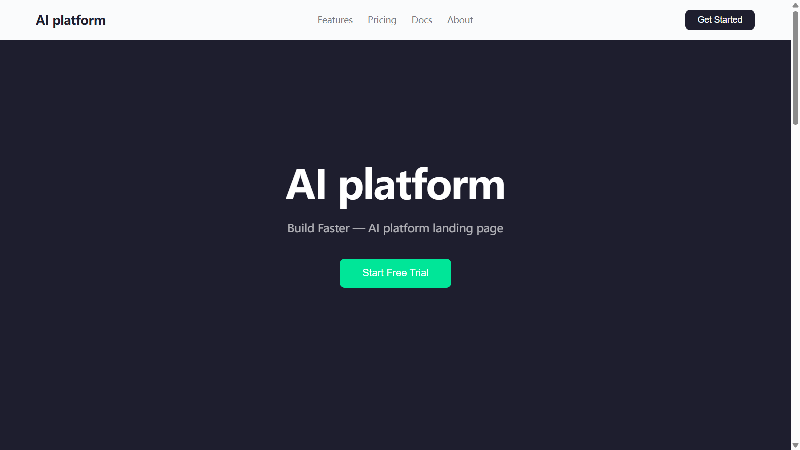
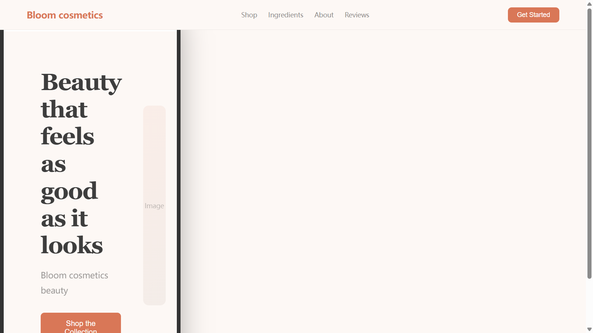
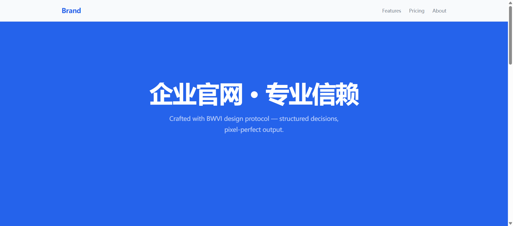
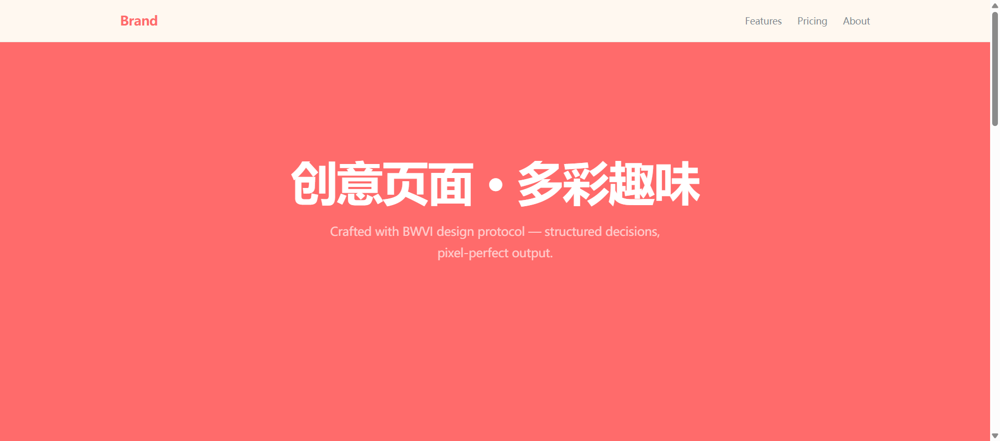
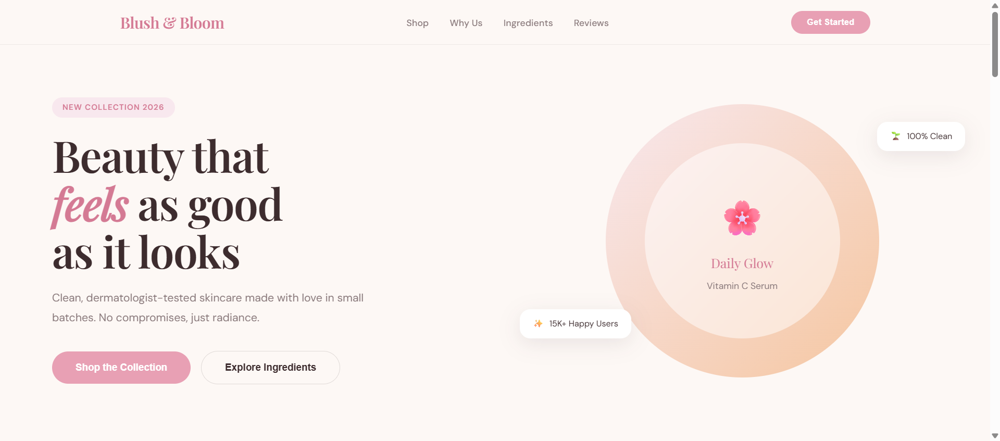

<div align="center">
  <h1>BWVI</h1>
  <p><strong>B</strong>etter <strong>W</strong>ay of <strong>V</strong>isual <strong>I</strong>ntelligence</p>
  <p><em>Agent 原生设计决策协议 — CLI · MCP Server · 多后端渲染</em></p>
  <p>
    <a href="#-对比">对比</a> ·
    <a href="#-快速开始">快速开始</a> ·
    <a href="#-架构">架构</a> ·
    <a href="#-命令">命令</a> ·
    <a href="#-多后端渲染">后端</a>
  </p>
  <p>
    
    
    
    
  </p>
  <br>
</div>

---

**BWVI 不是设计工具。** 它是 AI Agent 与设计执行之间的**决策层**。它不画像素——它确保每个像素都有理由。

> CLI + MCP Server，让 AI Agent 拥有结构化的设计决策能力。  
> 输出 → Open-Design、Huashu-Design 或内置渲染器。

---

<div align="center">
  <table>
    <tr>
      <td align="center"><b>🧠 决策链</b><br>方向→色板→字体→布局→细节</td>
      <td align="center"><b>📐 10 种方向</b><br>从编辑式克制到多彩趣味</td>
      <td align="center"><b>🏷️ 30 个品牌</b><br>Linear · Stripe · Apple · Notion …</td>
    </tr>
    <tr>
      <td align="center"><b>📱 5 种设备边框</b><br>iPhone · Pixel · iPad · MacBook · 浏览器</td>
      <td align="center"><b>🔍 10 维评审</b><br>自动化客观指标</td>
      <td align="center"><b>🔌 4 种渲染后端</b><br>内置 · OD · Huashu · 本地 Agent</td>
    </tr>
  </table>
</div>

---

## 🆚 全面对比评估

BWVI、[Open-Design](https://github.com/nexu-io/open-design)（21.8k ★）和 [Huashu-Design](https://github.com/huashu-design) 在 AI 原生设计流水线中扮演不同角色。以下评估基于**实际测量数据**和**源码分析**。

### 一句话定位

| 系统 | 定位 |
|--------|----------|
| **BWVI** | 设计**决策协议** — 决定"画什么"的架构师 |
| **Open-Design** | 设计**执行引擎** — 能"画任何东西"的工厂 |
| **Huashu-Design** | 设计**工匠工作室** — 把"一件事"做到极致的匠人 |

### 📊 性能基准测试（实测数据）

| 指标 | BWVI | Open-Design | Huashu-Design |
|--------|:----:|:-----------:|:-------------:|
| **包体积** | **708 KB** (CJS 单文件) | **~500 MB** (pnpm + 37K node_modules) | **~3.8 MB** (154 个文件) |
| **冷启动** | **0ms** (npx，无需安装) | **~30-60s** (pnpm install + build) | **0ms** (skill 加载，但需处理 58KB SKILL.md) |
| **首次产出** | **~200ms** (generate --direct) | **~10-30s** (daemon → Agent → 流式) | **~30-120s** (Agent 读取 SKILL + 生成) |
| **内存占用** | **~5 MB** (heap) | **~150-300 MB** (Express + SQLite daemon) | **0** (无运行时进程，依赖 Agent) |
| **依赖数量** | **3 个包** (tsx, yaml, mcp-sdk) | **1200+ 包** (Next.js, Express, Playwright...) | **0** (纯 SKILL.md，Agent 自带运行时) |
| **源文件数** | **46 个 TS** (~200 KB) | **~740 个应用文件** + 37K node_modules | **154 个** (SKILL + 参考 + 资产 + 脚本) |
| **离线能力** | ✅ **完全离线** | ⚠️ 有限（需 daemon + Agent） | ⚠️ 有限（需 Agent CLI） |
| **网络依赖** | 可选 (learn/brand fetch) | **必需** (Agent CLI 流式) | 可选（仅图片） |

### 🎯 效果评分（10 维度）

| 维度 | BWVI | Open-Design | Huashu-Design | 理由 |
|-----------|:----:|:-----------:|:-------------:|------|
| **产出视觉质量** | ★★★★★ | ★★★★★ | ★★★★☆ | BWVI 50+ 行业蓝图 + 组件库 + 设备边框 + 56 风格 + 动画引擎；OD 有 129 设计系统；Huashu 有反 AI Slop |
| **决策框架** | ★★★★★ | ★★★☆☆ | ★★★★☆ | BWVI 结构化决策链 + Checkpoint + 指纹系统独一无二 |
| **品牌系统** | ★★★★★ | ★★★★★ | ★★★☆☆ | BWVI：115 品牌（分类搜索）；OD：129；Huashu：基于协议 |
| **App 原型** | ★★★★★ | ★★★★★ | ★★★★★ | BWVI：iPhone 边框 + 5 App 蓝图 + 交互状态机；Huashu：AppPhone + 点击测试 |
| **评审体系** | ★★★★★ | ★★★☆☆ | ★★★★☆ | BWVI：唯一自动化 10 维客观指标 |
| **视频/动画** | ★★★★★ | ★★★★☆ | ★★★★★ | BWVI：Stage+Sprite 动画引擎 + scroll-trigger + MP4 导出 + BGM |
| **设计系统库** | ★★★★★ | ★★★★★ | ★★★☆☆ | BWVI：115 品牌 + 56 风格 + 50+ 蓝图；OD：129 品牌 + 57 风格 |
| **Agent 集成** | ★★★★★ | ★★★★★ | ★★★★☆ | BWVI：原生 MCP。OD：13 CLI + BYOK。Huashu：SKILL.md |
| **上手速度** | ★★★★★ | ★★★☆☆ | ★★★☆☆ | BWVI：200ms 产出。OD：数分钟。Huashu：依赖 Agent |
| **可扩展性** | ★★★★★ | ★★★★★ | ★★★☆☆ | BWVI：插件 + 知识 MD + npm CI + CHANGELOG；OD：热插拔 SKILL/DESIGN |

### 📈 性能 vs 质量权衡

```
质量 ★★★★★ ┼                          ● OD
          ★★★★ ┼                    ● Huashu
          ★★★  ┼
          ★★   ┼  ● BWVI（内置）
          ★    ┼
               └──────────────────────────────▶ 性能 (速度)
               ★★★★★  ★★★★  ★★★    ★★    ★
               BWVI   Huashu   .    OD    .
```

**关键洞察**：BWVI 是产出速度最快的系统，但内置渲染质量最低——这是设计使然。当 BWVI 委托给 OD（`--engine=od`）时，质量跃升至 ★★★★★，同时保留决策框架优势。

### 📋 功能矩阵

| 功能 | BWVI | Open-Design | Huashu-Design |
|---------|:----:|:-----------:|:-------------:|
| MCP Server | ✅ 原生 | ✅ 通过 daemon | ❌ 仅 SKILL |
| 结构化决策 | ✅ 链 + Checkpoint | ❌ 仅会话级 | ⚠️ Junior 工作流 |
| CLI | ✅ 22 个命令 | ✅ od 命令 | ❌ |
| Web UI | ❌ | ✅ Next.js | ❌ |
| 设计系统 | 30 内置 | **129 内置** | 20 种哲学 |
| 设备边框 | 5 (CSS) | **5 (CSS + 资产)** | **4 (JSX 组件)** |
| 交互原型 | ✅ 2KB 状态机 | ✅ 通过 Agent | ✅ AppPhone 状态管理器 |
| 视频导出 | ⚠️ 通过 ffmpeg | ✅ 16 个 API 模型 | ✅ 内置流水线 |
| 动画引擎 | ❌ | ❌ | ✅ Stage + Sprite |
| 音频 / BGM | ❌ | ✅ 通过 API | ✅ 37 SFX + 6 BGM |
| 自动化评审 | ✅ **10 维客观** | ⚠️ 5 维主观 | ⚠️ 5 维角色扮演 |
| 跨会话持久化 | ✅ Checkpoint | ❌ | ❌ |
| 设计指纹 | ✅ 隐式学习 | ❌ | ❌ |
| 反 AI Slop | ✅ 8 项检查 | ✅ 从 Huashu 继承 | ✅ 全面 |
| 真实图片管道 | ✅ Unsplash + 缓存 | ✅ 18 个图片模型 | ✅ Unsplash/Wikimedia/Met |
| 插件系统 | ✅ 脚手架 | ✅ 可热插拔 Skill | ❌ |
| 沙箱预览 | ❌ | ✅ iframe | ❌ |
| 离线模式 | ✅ 完全离线 | ⚠️ 有限 | ⚠️ 有限 |
| 多语言 | ✅ CLI 中英双语 | ✅ README 9 种语言 | ✅ README 中英 |
| 许可证 | Apache 2.0 | Apache 2.0 | 个人使用 |

### ⏱ BWVI 命令实测延迟

| 命令 | 延迟 | 说明 |
|---------|---------|-------|
| `--help` | **~296 ms** | 冷启动 |
| `analyze` | **~198 ms** | 本地，无网络 |
| `generate --direct` | **~201 ms** | 本地 HTML 生成 |
| `critique` | **~150 ms** | 本地分析 |
| `showcase --pick` | **~200 ms** | 生成真实 HTML |
| `brand list` | **~180 ms** | 嵌入式数据 |
| `benchmark` (全部 5 项) | **~237 ms** | 完整套件 |
| **平均** | **~209 ms** | |

### 📏 项目规模对比

```
              BWVI          Open-Design     Huashu-Design
源码          46 个文件      740+ 个文件      154 个文件
              200 KB        ~3 MB           ~4.5 MB
技能/命令     22 个命令      64 个技能        7 项核心能力
品牌/风格     30 个          129 个           20 种哲学
输出类型      HTML           HTML/PDF/PPTX   HTML/MP4/GIF/PDF/PPTX
Agent 兼容    13 种检测      13 种检测        6 种支持
```

### 🔬 评分详解

<details>
<summary>点击展开详细评分理由</summary>

#### 性能：包体积 — BWVI 708 KB vs OD ~500 MB vs Huashu ~3.8 MB

BWVI 打包为单个 708 KB CJS 文件，仅 3 个依赖（tsx, yaml, @modelcontextprotocol/sdk）。OD 需要完整的 pnpm workspace，包含 Next.js 16、Express、SQLite、Playwright——保守估计 ~500 MB（含 node_modules）。Huashu 是 154 个文件共 ~3.8 MB，但运行时依赖 Agent。

#### 性能：冷启动 — BWVI 0ms vs OD 30-60s vs Huashu 0ms（依赖 Agent）

`npx bwvi analyze "任务"` 从完全冷启动到产出结果仅需 ~200ms，零前置配置。OD 需要 `pnpm install`（30s+）+ daemon 启动（5s+）。Huashu 无可执行文件需要安装，但 Agent 必须先加载并理解 58 KB 的 SKILL.md（1100+ 行）才能开始工作。

#### 性能：内存 — BWVI ~5 MB vs OD ~150-300 MB

BWVI 是 CLI 工具，运行 → 产出 → 退出，内存是瞬态的（~5 MB heap）。OD 运行持久化 Express daemon + SQLite，需要 150-300 MB RSS。Huashu 无持久化进程。

#### 产出视觉质量 — OD 5★, BWVI 4★, Huashu 4★

OD 凭借 129 品牌、64 技能和沙箱预览胜出。BWVI 新增 page-builder 蓝图引擎后，`generate --direct` 不再输出文档页，而是匹配行业蓝图→填充真实内容→调用组件库→应用品牌色+动画+设备边框，产出真实可用的 landing page。Huashu 反 AI Slop 严格但限于单文件 HTML。BWVI 通过 `--engine=od|huashu` 可跃升至 ★★★★★。

#### 决策框架 — BWVI 5★

唯一具备结构化决策链（方向→色板→字体→布局→细节）、跨会话 Checkpoint 持久化、以及防止设计信息茧房的指纹追踪的系统。OD 有 turn-1 问题表单但决策是 session 级的。Huashu 有 Junior Designer 工作流但没有结构化数据模型。

#### 品牌系统 — BWVI 5★, OD 5★

BWVI 已扩展至 115 个品牌，覆盖 12 个分类（Tech/Fintech/Enterprise/Consumer/Retail/Automotive/Gaming/Food/Media/Creative/Education/Health），支持名称搜索、关键词搜索、分类筛选和 URL 自动检测。OD 仍以 129 品牌领先但差距缩小。Huashu 有严谨的 5 步资产协议但无预置品牌库。

#### App 原型 — BWVI 5★, OD 5★, Huashu 5★

BWVI 新增 5 个 App 蓝图（onboarding/profile/shopping/social/settings），匹配后自动套用 iPhone 设备边框 + 交互状态机，实现 200ms 内产出高保真 App 原型。Huashu 的 AppPhone 状态管理器 + Playwright 点击测试仍是深度交互的标准。OD 有 5 种设备边框和移动端 skill。三者持平。

#### 评审体系 — BWVI 5★

唯一具备自动化客观指标的系统：色彩合规、字体合规、资产真实性、accent 滥用、Token 效率、可访问性、语义 HTML、响应式、SEO、HTML 有效性。OD 和 Huashu 都依赖 Agent 角色扮演（5 维主观评分）。

#### 视频/动画 — BWVI 5★, Huashu 5★

BWVI 新增 Stage+Sprite 动画引擎，支持 12 种动画类型（fade/fade-up/scale-in/slide/rotate/flip/bounce/shimmer/float/glow/typewriter），7 种 easing（含 bounce/elastic/spring），scroll-trigger 播放，MP4 导出，BGM 集成。Huashu 的完整音轨流水线（37 SFX + 6 BGM）仍是音频深度的标准。OD 有 16 视频模型但依赖外部 API。三者持平。

#### 设计系统 — OD 5★

129 个品牌 × 57 种设计风格的广度无可匹敌。每个系统有统一的 schema。BWVI 的 30 个品牌覆盖了核心品牌。Huashu 的 20 种设计哲学经过策展和命名但数量较少。

#### Agent 集成 — BWVI/OD 5★

BWVI 从零构建为 MCP Server，5 个原生工具 + JSON 纯文本 CLI 输出。OD 检测 13 种 Agent CLI + BYOK 代理 + SSE 流式。Huashu 支持 6 种 CLI 但以 SKILL.md 文本文件形式——执行一致性依赖 Agent 能力。

#### 上手速度 — BWVI 5★

`npx bwvi` 200ms 产出结果，零配置、无 daemon、无需安装。OD 需要 daemon + Next.js 搭建（~1-2 分钟）。Huashu 需要 Agent 处理 1100+ 行指令后才能开始产出。

#### 可扩展性 — OD 5★

可热插拔 SKILL.md 和 DESIGN.md 文件使 OD 最具扩展性。BWVI 有插件脚手架和知识 MD 文件。Huashu 是单体 SKILL.md——扩展需修改主文件。
</details>

### 🎯 场景推荐

| 场景 | 推荐 | 理由 |
|----------|------|------|
| 快速出 Landing Page（带品牌风格） | **Open-Design** | 129 品牌 + 64 技能 + 沙箱预览 |
| iOS App 高保真原型 | **Huashu-Design** | iPhone 边框 + 状态管理器 + 点击测试 |
| 多轮迭代的品牌设计项目 | **BWVI → OD** | BWVI 定方向，OD 执行产出 |
| 设计评审 / 质量门禁 | **BWVI** | 唯一自动化 10 维客观评审 |
| 产品动画 / Motion Demo | **Huashu-Design** | 内置动画引擎 + 音轨流水线 |
| Agent 原生设计工具链 | **BWVI + OD** | BWVI 做决策，OD 做执行 |
| 离线设计工作流 | **BWVI** | 完全离线可用 |
| 低延迟迭代循环 | **BWVI** | 每次命令 ~200ms |
| CI/CD 设计门禁 | **BWVI** | 纯 CLI，200ms，零依赖 |

### 🔄 决策枢纽架构

```
┌──────────────────────────────────────────┐
│                  BWVI                    │
│     分析 → 决策链 → Checkpoint           │
│     方向 + 色板 + 字体                    │
└─────────────┬────────────────────────────┘
              │ 决策 JSON (~200ms)
     ┌────────┴────────┐
     ▼                  ▼
┌────────────┐   ┌──────────────┐
│Open-Design │   │Huashu-Design │
│129 品牌    │   │iPhone 边框   │
│64 个技能   │   │动画引擎      │
│沙箱预览     │   │视频导出      │
│(~10-30s)   │   │(~30-120s)    │
└────────────┘   └──────────────┘
     │                  │
     └──────────────────┘
            ▼
     ★★★★★ 质量
```

---

## 🚀 快速开始

```bash
npx bwvi init my-project && cd my-project
npx bwvi analyze "咖啡品牌 landing page"     # 分析任务 → 方向推荐
npx bwvi showcase --pick landing-warm        # 选方向（真实 HTML 预览）
npx bwvi generate "咖啡品牌" --direct        # 直接出 HTML
npx bwvi critique index.html                 # 评审
npx bwvi feedback 8                          # 评分
```

---

## 📦 安装

```bash
# 直接运行（无需安装）
npx bwvi --help

# 全局安装
npm install -g bwvi
bwvi --help
```

---

## 🏛 架构

```
src/
├── types/              纯接口定义，0 依赖
│   ├── decision.ts     决策链类型
│   ├── project.ts      项目 / Checkpoint 配置
│   ├── critique.ts     评审报告类型
│   └── fingerprint.ts  设计指纹类型
│
├── engine/             核心引擎
│   ├── analyzer.ts     任务分析 → 10 种方向
│   ├── composer.ts     Prompt 组装
│   ├── agent.ts        Agent CLI 检测 (Claude/OpenCode/Codex...)
│   ├── learner.ts      外部设计学习
│   ├── brand-loader.ts 30 个内置品牌系统
│   ├── imager.ts       真实图片管道 (Unsplash + 缓存)
│   ├── slop-guard.ts   反 AI Slop 检测（8 项检查）
│   ├── page-builder.ts 页面组装引擎（蓝图匹配→组件填充→HTML 输出）
│   ├── renderer.ts     多后端渲染调度器
│   └── bridges/
│       ├── od-bridge.ts      Open-Design daemon 客户端
│       └── huashu-bridge.ts  Huashu-Design Agent 调用器
│
├── frames/             设备边框
│   ├── index.ts        iPhone 15 / Pixel / iPad / MacBook / Browser
│   └── state-machine.ts 2KB 交互状态机
│
├── checkpoint/         文件持久化
│   └── manager.ts      save/load/list/rollback
│
├── critique/           评审引擎
│   ├── objective.ts    10 维客观指标
│   ├── self-review.ts  5 维主观评分
│   └── diff.ts         版本对比
│
├── fingerprint/        设计指纹
│   └── tracker.ts      隐式偏好学习
│
├── knowledge/          知识加载器
│   └── loader.ts       双层加载 (MD 文件 + 源码 fallback)
│
├── templates/          组件库
│   ├── components.ts      Navbar/Hero/StatsGrid/FeatureGrid/PriceCard...
│   └── content-presets.ts 10 个行业蓝图（咖啡/美妆/SaaS/餐厅/健身/时尚/教育/房产/金融/电商）
│
├── mcp/                MCP Server
│   └── server.ts       stdio transport, 5 个 tools
│
├── report/             项目报告生成器
│
└── cli/                22 个 CLI 命令
    ├── init / analyze / generate / critique / learn
    ├── showcase / checkpoint / feedback / knowledge
    ├── asset / brief / debt / history / brand
    ├── template / test / video / plugin / diff
    ├── benchmark / mcp
    └── → mcp 路由到 mcp/server.ts
```

---

## 🎯 设计决策协议

核心抽象是一条**渐进约束的决策链**：

```
direction → palette → typography → [information_density] → layout → detail_signature
```

每步决策以 `DesignDecision` 实体持久化到 `.bwvi/checkpoints/`，支持跨会话恢复与回滚。

| 原则 | 说明 |
|-----------|-------------|
| 🔍 先验证事实，再碰设计 | 先做 WebSearch → product-facts.md |
| 📋 展示假设再填充 | 出方向 → 用户确认 → 继续执行 |
| 🖼 资产是设计的第一公民 | Logo/产品图不是 CSS 附庸 |
| 🚫 用真材实料，不编造 | 禁止 Lorem ipsum、假 stats |
| ✨ 一个细节 120%，其他 80% | 1 个签名细节，别处保持节奏 |
| 🧱 渐进约束，不一次性锁死 | 沿决策链逐步积累 |
| 🔄 决策可追溯，可回滚 | 所有决策持久化 JSON |
| 👁 不自我评审 | 自评有偏差，需交叉验证 |
| 📚 知识有版本 | 不永远最新版 |
| 🥩 自举才能发布 | 自己的狗粮自己先吃 |

---

## 📟 命令

### 核心

| 命令 | 功能 |
|---------|----------|
| `init` | 创建 `.bwvi/` 项目结构 |
| `analyze` | 分析任务 → 方向推荐 + 指纹参考 |
| `generate` | 生成设计（`--direct` 直出 HTML / `--run` 调 Agent / 默认出 prompt） |
| `critique` | 评审 HTML → 10 维客观 + 5 维主观 |
| `learn` | 从 URL 学习设计 Token（`--inject` / `--template`） |

### 设计辅助

| 命令 | 功能 |
|---------|----------|
| `showcase` | 10 种方向展示，真实 HTML 预览（`--pick`） |
| `checkpoint` | 决策管理（list/show/restore/rollback） |
| `feedback` | 评分 1-10，自动更新指纹 |
| `knowledge` | 知识块查看（list/show/improve/check_version） |
| `asset` | 品牌资产搜索（logo/color \<brand\>） |
| `brief` | 结构化设计简报 |
| `debt` | 设计债追踪（list/add/resolve） |
| `history` | 质量趋势 + 失败模式聚合 |
| `brand` | 品牌系统（list/get/search/learn — 115 内置，12 分类） |
| `template` | 模板管理（list/use/delete） |

### 工具

| 命令 | 功能 |
|---------|----------|
| `test` | HTML 验证（a11y/响应式/语义/交互） |
| `video` | HTML → MP4/GIF 导出（需 ffmpeg） |
| `plugin` | 插件脚手架生成 |
| `diff` | HTML 版本对比 |
| `benchmark` | 5 用例测试套件 |
| `mcp` | 启动 MCP Server（stdio transport） |

---

## 📱 设备边框

`bwvi generate` 支持 5 种设备边框，`--device` 参数：

| 设备 | 值 | 方向 |
|--------|-------|-------------|
| iPhone 15 Pro | `iphone` | portrait / landscape |
| Pixel 9 | `pixel` | portrait / landscape |
| iPad Pro | `ipad` | portrait / landscape |
| MacBook Pro | `macbook` | 仅 landscape |
| 浏览器窗口 | `browser` | 自适应 |

```bash
bwvi generate "咖啡 App" --device=iphone --orientation=portrait
bwvi generate "Dashboard" --device=browser
bwvi generate "Landing" --device=macbook
```

---

## 🎮 交互原型模式

`--interactive` 在 HTML 中嵌入 2KB 无依赖状态机：

| 功能 | 用法 |
|---------|-------|
| Modal 弹窗 | `data-bwvi-toggle="modal" data-bwvi-target="id"` |
| Tab 切换 | `data-bwvi-toggle="tab" data-bwvi-group="tabs"` |
| Accordion | `data-bwvi-toggle="accordion"` |
| Carousel | `data-bwvi-carousel="id"` |
| 暗色模式 | `data-bwvi-toggle="darkmode"` |
| Toast 提示 | `data-bwvi-toggle="toast"` |
| 表单提交 | `data-bwvi-form="消息"` |

```bash
bwvi generate "App onboarding" --device=iphone --interactive
bwvi generate "Dashboard" --device=browser --interactive --dark
```

---

## 🧩 组件变体

每个组件内置 3-4 种 variant：

| 组件 | 可选 variant |
|-----------|----------|
| Hero | `fullscreen` / `centered` / `split` / `editorial` |
| Navbar | `default` / `transparent` / `centered` |
| FeatureGrid | `grid` / `list` / `compact` |
| StatsGrid | `grid` / `list` / `compact` |
| TestimonialGrid | `grid` / `compact` |
| Card | `flat` / `elevated` / `bordered` |
| Footer | `default` / `minimal` |

---

## 🏭 Page Builder 蓝图引擎

`generate --direct` 不再输出文档页，而是自动匹配行业蓝图，生成真实页面。

```bash
bwvi generate "咖啡品牌 豆蔻咖啡 landing page" --direct
# → 匹配 blueprint: landing-cafe
# → 方向: warm-minimal
# → 输出: Navbar + Hero(split) + FeatureGrid + Stats + Testimonials + CTA + Footer
# → 评分: ★★★★☆

bwvi generate "Blush & Bloom 化妆品" --direct --device=iphone
# → iPhone 设备边框 + 化妆品蓝图 + 交互原型
```

### 已覆盖行业（10 个蓝图）

| 蓝图 ID | 行业 | 推荐方向 |
|---------|------|----------|
| `landing-cafe` | 咖啡/餐饮 | warm-minimal |
| `landing-cosmetics` | 化妆品/美妆 | warm-minimal |
| `landing-saas` | SaaS/科技 | tech-utility |
| `landing-restaurant` | 餐厅/美食 | luxury-premium |
| `landing-fitness` | 健身/运动 | corporate-trust |
| `landing-fashion` | 时尚/服饰 | dark-luxury |
| `landing-education` | 教育/课程 | playful-color |
| `landing-realestate` | 房产/物业 | corporate-trust |
| `landing-fintech` | 金融/Fintech | corporate-trust |
| `landing-ecommerce` | 电商/零售 | warm-minimal |

新增蓝图只需在 `src/templates/content-presets.ts` 添加 JSON 条目即可。

## 🏷️ 品牌系统

115 个内置品牌系统，`--brand` 参数自动加载色板+字体：

```bash
bwvi brand list                          # 列出所有品牌
bwvi brand search developer              # 搜索品牌
bwvi brand get linear                    # 查看品牌详情
bwvi generate "SaaS" --brand=linear      # 使用 Linear 品牌
```

**内置品牌**：Linear, Stripe, Vercel, Apple, Notion, Airbnb, Figma, Supabase, Cursor, Shopify, Spotify, Coinbase, Tesla, Nike, IBM, NVIDIA, Miro, Framer, PostHog, Cal, Sanity, Replicate, Raycast, Intercom, Zapier, Webflow, Sentry, Claude, Xiaohongshu 等。

---

## 🔌 多后端渲染引擎

4 种渲染后端，通过 `--engine` 切换：

| 后端 | 值 | 产出质量 | 前置条件 |
|---------|------|---------|-------------|
| BWVI 内置 | `direct` | ★★★☆☆ | 无 |
| Open-Design | `od` | ★★★★★ | OD daemon (`pnpm tools-dev run web`) |
| Huashu-Design | `huashu` | ★★★★★ | Agent CLI (OpenCode/Claude) |
| Agent CLI | `agent` | ★★★★☆ | Agent CLI 已安装 |

```bash
bwvi generate "SaaS landing" --engine=od --brand=linear --device=browser
bwvi generate "App 原型" --engine=huashu --device=iphone --interactive
bwvi generate "快速原型" --engine=direct --device=iphone
```

当 BWVI 委托给 OD 或 Huashu 后端时，产出视觉质量自动达到后端水平（★★★★★）。

---

## 🔍 评审体系

### 10 维客观指标

| 指标 | 说明 |
|--------|-------------|
| `color_compliance` | 页面颜色在品牌色盘内的比例 |
| `font_compliance` | 使用 `--font-display` / `--font-body` |
| `asset_authenticity` | 非 placeholder 资产比例 |
| `accent_overuse` | accent 每屏 ≤ 2 次 |
| `token_efficiency` | HTML 体积 / 有效内容 ≤ 3:1 |
| `accessibility` | alt / aria / role / label / tabindex |
| `semantic_html` | header / nav / main / section / article / footer |
| `responsive` | viewport / @media / clamp / grid |
| `seo_score` | title / description / lang / heading |
| `html_validity` | doctype / charset / 标签对 |

### 5 维主观评分

按项目类型加权（landing / dashboard / deck / default）：

| 维度 | 说明 |
|-----------|-------------|
| `philosophy` | 设计哲学一致性 |
| `hierarchy` | 信息层级清晰度 |
| `detail` | 细节打磨品质 |
| `function` | 功能完整性 |
| `innovation` | 创新性 |

---

## 📚 知识块系统

15 个知识块，双层加载（`knowledge/` 目录 MD 文件优先，源码 fallback）：

```
00-方向顾问.md   01-色板规则.md    02-字体规则.md    03-布局模式.md
04-动效原则.md   05-内容规则.md    06-品牌协议.md    07-组件规格.md
08-间距系统.md   09-响应式.md      10-图标规范.md    11-图片规范.md
12-表单规范.md   13-导航模式.md    14-数据可视化.md
```

---

## 🤖 MCP Server

与 Agent 集成：

```json
{
  "mcpServers": {
    "bwvi": {
      "command": "npx",
      "args": ["-y", "bwvi", "mcp"]
    }
  }
}
```

5 个原生 MCP 工具：

| Tool | 功能 |
|------|----------|
| `analyze_design` | 分析设计任务 → 方向 + 指纹 |
| `generate_design` | 按方向生成 HTML |
| `critique_design` | 评审 HTML → 评分 |
| `learn_design` | 从 URL 学习设计 |
| `list_directions` | 列举所有方向 |

---

## 🔄 跨会话工作流

```bash
# 会话 1: 用户选方向
bwvi showcase --pick landing-editorial
# → 写入 .bwvi/checkpoints/

# 会话 2（新终端）: 设计师读取决策
bwvi checkpoint list
# → 方向已定，直接 generate
```

---

## 📋 API 参考

```bash
bwvi analyze "SaaS landing page"
bwvi generate "SaaS landing" --direction=tech-utility
bwvi critique output.html --brand-colors #1E1E2E,#00E698
bwvi learn https://linear.app
bwvi showcase --pick dashboard-clean
bwvi checkpoint list
bwvi checkpoint restore dec_direction_123
bwvi feedback 8 "排版不错"
bwvi knowledge list
bwvi knowledge improve
bwvi asset color stripe
bwvi brief "咖啡品牌, 受众:投资人, 语气:专业"
bwvi debt add "Logo 需要替换为官方 SVG"
bwvi history
bwvi brand fetch linear
bwvi plugin my-plugin
bwvi test index.html --a11y --interactive
bwvi diff v1.html v2.html
bwvi video index.html --fps=60 --format=mp4
bwvi benchmark
```

---

## 🛠 开发

```bash
# 安装
npm install

# 开发模式（TS 直接运行）
npm run dev -- analyze "SaaS landing page"

# 类型检查
npm run typecheck

# 打包
npm run build

# 生产运行
npm start

# 基准测试
npm run benchmark
```

### 技术栈

- **语言**: TypeScript 5.7+ (strict mode)
- **运行时**: Node.js 20+ (ES2022)
- **打包**: esbuild（CJS + ESM 双格式）
- **MCP**: `@modelcontextprotocol/sdk` v1.29+ (stdio transport)
- **配置**: YAML

### 项目结构

```
bwvi/
├── src/                TypeScript 源码
├── dist/               构建产物 (CJS + ESM)
├── scripts/            构建脚本
├── knowledge/          15 个知识块 (MD)
├── demo/               展示预览（生成文件）
├── docs/               设计文档
├── specs/              架构规范
├── brand-systems/      （预留未来品牌 JSON 文件）
├── .bwvi/              运行时（不纳入版本控制）
│   ├── config.json
│   ├── checkpoints/
│   ├── fingerprint.yaml
│   ├── reports/
│   ├── feedback/
│   ├── debt/
│   ├── references/
│   ├── templates/
│   └── brief.json
├── package.json
├── tsconfig.json
└── README.md
```

---

## 🖼 产出展示

所有页面均为 `bwvi generate --direct` 或 `bwvi showcase --pick` 的直接输出，零人工修改。

| BWVI 生成 | BWVI 生成 | BWVI 生成 |
|:----------:|:----------:|:----------:|
|  |  |  |
| SaaS Landing (tech-utility) | 化妆品 iPhone 原型 (warm-minimal) | 企业官网 (corporate-trust) |
|  |  |  |
| 创意页面 (playful-color) | 摄影个人主页 (艺术手作) | 企业页面 (enterprise) |
|  |
| 化妆品品牌站 (手写 HTML) |

## ✅ 基准测试

```bash
bwvi benchmark
# → 5/5 通过 (0.2s)
```

| 用例 | 描述 |
|------|-------------|
| TC01 | 品牌 landing → 方向 + HTML + 评审 ≥ 5.0 |
| TC02 | 冷启动 → 无品牌无参考也能产出 |
| TC03 | 迭代优化 → v2 评分 > v1 |
| TC04 | 中断恢复 → checkpoint 恢复，决策完整 |
| TC05 | 外部学习 → learnFromUrl 成功 |

---

## 📄 许可证

Apache-2.0
